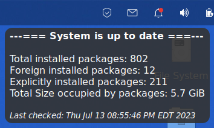
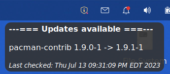

# yup
Genmon update script for Arch Linux

This is a genmon script (yup) and complimentary yup2 script to supply update checking and execution functionality for Arch Linux using the yay helper.

**Screenshot:**

